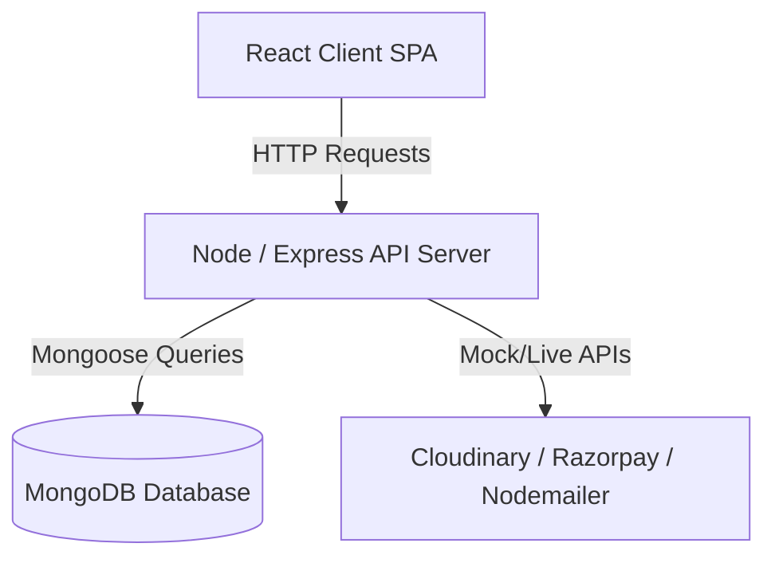

# Software Development Lifecycle (SDLC) Phase-Wise Templates

These templates are structured to guide you through the lifecycle of your software project (such as SHOPEZ), from the initial spark of an idea to the final development and deployment phase.

---

## 1. Brainstorming & Ideation Phase Template

Use this template to capture initial concepts, define core objectives, and map out the target audience.

```markdown
# [Project Name] - Brainstorming & Ideation Document

## 1. Project Vision
* **Tagline**: (One sentence describing what the product does)
* **Elevator Pitch**: (A short paragraph explaining the core value proposition)

## 2. Problem Statement
* What specific problem is this project trying to solve?
* Who faces this problem? How do they solve it currently?

## 3. Target Audience & Personas
* **User Persona A**: (e.g., "The Busy Shopper" - characteristics, needs, pain points)
* **User Persona B**: (e.g., "The Small Merchant" - characteristics, needs, pain points)

## 4. Key Differentiators & Value Proposition
* Why will users choose this product over existing alternatives?
* What is the "killer feature" or unique element of this project?

## 5. Ideation Brainstorming Table
| Idea Description | Potential Impact (H/M/L) | Implementation Effort (H/M/L) | Decision (Adopt / Archive / Park) |
| :--- | :---: | :---: | :---: |
| e.g., Implement 1-click checkout | High | Medium | Adopt |
| e.g., Voice-controlled searching | Medium | High | Park |
```

---

## 2. Requirement Analysis Phase Template

Use this template to list the software's functional and non-functional requirements.

```markdown
# [Project Name] - Requirement Specifications

## 1. Functional Requirements (FRs)
These specify what the system *must do*. Group by module or user role.

### User / Customer Module
* **FR-1.1**: The system must allow users to register with name, email, and password.
* **FR-1.2**: Users must be able to log in securely using encrypted passwords and JWT sessions.
* **FR-1.3**: Users must be able to maintain a product wishlist.

### Product & Checkout Module
* **FR-2.1**: Users must be able to view, search, and filter products by category and price range.
* **FR-2.2**: Users must be able to add products to a shopping cart, modify quantities, and clear items.
* **FR-2.3**: The checkout system must support payments (simulated or live) and verify order status.

### Admin Module
* **FR-3.1**: Administrators must be able to perform CRUD operations on products.
* **FR-3.2**: Administrators must have access to store metrics dashboards (revenue, counts, charts).

## 2. Non-Functional Requirements (NFRs)
These specify how the system *performs*.

* **NFR-1 (Security)**: All user passwords must be hashed using bcrypt before database storage. JWT keys must be signed.
* **NFR-2 (Performance)**: The product catalog must load in under 2 seconds.
* **NFR-3 (Usability)**: The UI must be responsive across desktop, tablet, and mobile browsers.

## 3. System Boundaries & Out of Scope
* List features that are explicitly excluded from the current phase/release to avoid scope creep.
```

---

## 3. Project Planning Phase Template

Use this template to break down deliverables, outline milestones, assign tasks, and assess project risks.

```markdown
# [Project Name] - Project Plan & Roadmap

## 1. Scope & Deliverables
* List of tangible items to be delivered at the end of the project (e.g., source code, database scripts, technical documentation).

## 2. Development Timeline (Sprint / Milestone Plan)
| Milestone | Description | Target Date | Status |
| :--- | :--- | :---: | :---: |
| **Milestone 1** | Database modeling, auth configurations, API structures setup | DD/MM/YYYY | Pending |
| **Milestone 2** | Product, Cart, and Checkout controller development | DD/MM/YYYY | Pending |
| **Milestone 3** | UI layout, state integrations, core browsing views | DD/MM/YYYY | Pending |
| **Milestone 4** | Checkout simulation, admin panel dashboards | DD/MM/YYYY | Pending |
| **Milestone 5** | Integration testing, debugging, and deployment | DD/MM/YYYY | Pending |

## 3. Resource & Stack Allocation
* **Database**: MongoDB / PostgreSQL
* **Backend**: Node.js + Express
* **Frontend**: React (Vite / NextJS)
* **Styling**: Bootstrap / Tailwind CSS

## 4. Risk Assessment & Mitigation Plans
| Risk ID | Risk Description | Probability (H/M/L) | Impact (H/M/L) | Mitigation Strategy |
| :---: | :--- | :---: | :---: | :--- |
| **R-1** | Integration credentials fail or expire | Medium | High | Implement robust local mock fallbacks for payment and storage APIs. |
| **R-2** | Scope creep delays delivery | High | Medium | Lock requirements before starting Milestone 2; move extra ideas to Phase 2. |
```

---

## 4. Project Design Phase Template

Use this template to define database schemas, network architectures, and component relationships.

```markdown
# [Project Name] - System & Architecture Design

## 1. High-Level Architecture


## 2. Database Schema Details
List collections, data types, and references.

### Collection: Users
* `_id` (ObjectId, Primary Key)
* `name` (String, required)
* `email` (String, required, unique)
* `password` (String, required, hashed)
* `role` (String, default: 'user')
* `wishlist` (Array of Product ObjectIds)

### Collection: Products
* `_id` (ObjectId, Primary Key)
* `name` (String, required)
* `price` (Number, required)
* `stock` (Number, required)
* `reviews` (Subdocument Array: rating, comment, user reference)

## 3. API Route Design
| Method | Endpoint | Description | Auth Required |
| :---: | :--- | :--- | :---: |
| **POST** | `/api/auth/register` | Register a new user | No |
| **POST** | `/api/auth/login` | Log in and return JWT token | No |
| **GET** | `/api/products` | Query products list | No |
| **POST** | `/api/cart/add` | Add product to active cart | Yes |
```

---

## 5. Project Development Phase Template

Use this template to outline programming style rules, branch guidelines, and verification tests.

```markdown
# [Project Name] - Development Guidelines & Standards

## 1. Branching & Git Workflow
* **Main Branch** (`main`): Holds stable, production-ready release code. Directly committing to `main` is restricted.
* **Development Branch** (`dev`): Holds integration code for current milestones.
* **Feature Branches** (`feature/feature-name`): Branches created for specific functional implementations (e.g., `feature/cart-endpoints`).

## 2. Coding Conventions
* **Variable Naming**: camelCase (Javascript standard).
* **Components**: PascalCase (React standard).
* **Comments**: Include brief docstrings explaining the utility of custom functions or middleware blocks.
* **Linting**: Keep code formatting consistent (use ESLint/Prettier configuration checks).

## 3. Pull Request (PR) Validation Checklist
Before merging any feature branch into the integration branch:
- [ ] Code compiles without warnings/errors.
- [ ] Added feature matches the requirements specifications.
- [ ] No hardcoded configuration secrets (credentials are placed in `.env`).
- [ ] Database updates match Mongoose model structures.

## 4. Verification Plan
* **Unit Tests**: Check that endpoints respond with standard success/error structures.
* **E2E Check**: Run user signup, cart addition, checkout transaction, and verify database states.
```
